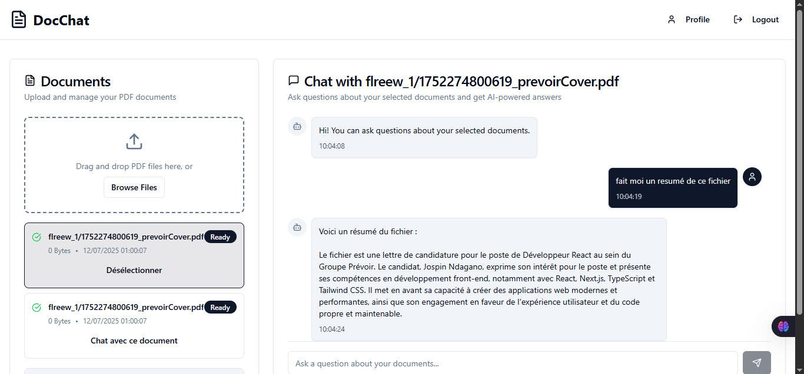

# Doc-Chat - PDF Document Chat Application

[](https://nextjs.org/)
[](https://www.typescriptlang.org/)
[](https://www.langchain.com/)
[](https://vitejs.dev/)
[](https://tailwindcss.com/)

A modern web application that allows users to upload PDF documents and interact with them using Retrieval-Augmented Generation (RAG) powered by LangChain and TypeScript.



## Features

- **PDF Document Upload**: Drag-and-drop interface for uploading PDF files
- **Text Extraction**: Automatic text extraction from uploaded documents
- **Vector Embeddings**: Conversion of document content into vector embeddings
- **Semantic Search**: Intelligent document querying using RAG methodology
- **Real-time Chat**: Interactive chat interface for document conversations
- **Modern UI**: Clean, responsive interface built with shadcn-ui and Tailwind CSS

## Tech Stack

### Frontend
- **Vite**: Next-generation frontend tooling
- **TypeScript**: Type-safe JavaScript development
- **React**: UI framework with modern hooks
- **shadcn-ui**: Beautifully designed components
- **Tailwind CSS**: Utility-first CSS framework

### Backend & AI
- **LangChain**: RAG implementation and document processing
- **GROQ API**: LLM integration for intelligent responses
- **Supabase**: Authentication, database, and storage solutions
- **PDF.js**: Client-side PDF text extraction
- **Vector Store**: Document embedding and retrieval system

## Installation

```bash
# Clone the repository
git clone https://github.com/your-username/doc-chat.git
cd doc-chat

# Install dependencies
npm install

# Set up environment variables
cp .env.example .env
# Add your OpenAI API key to .env
GROQ_API_KEY=your_openai_api_key_here

# Start development server
npm run dev